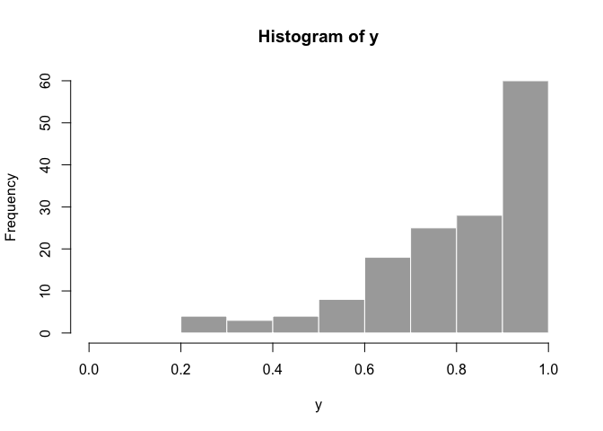
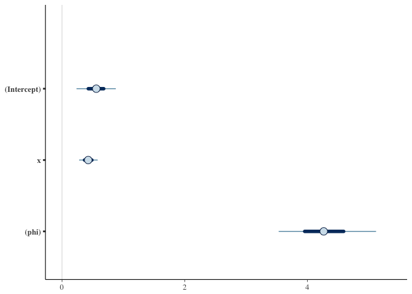
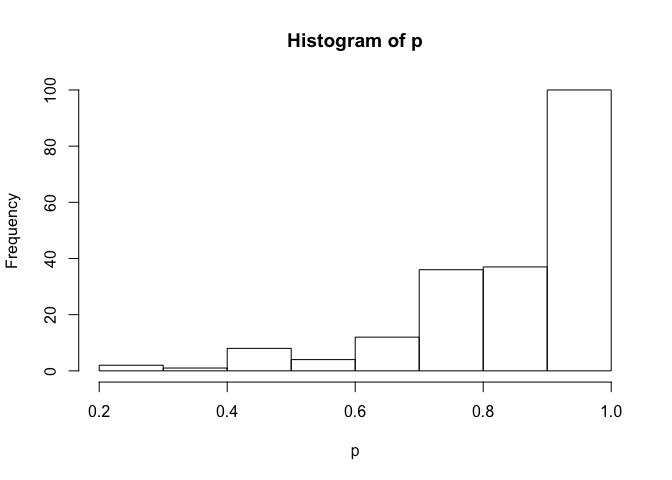
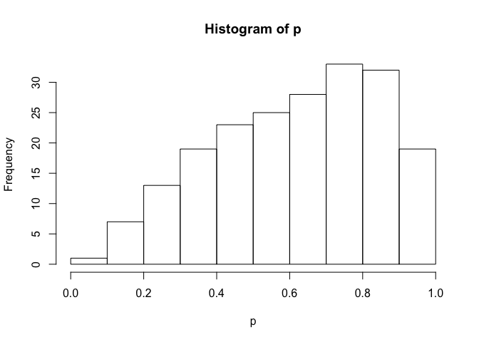
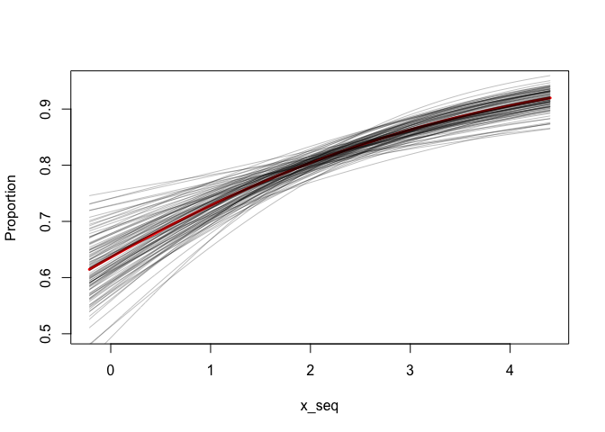
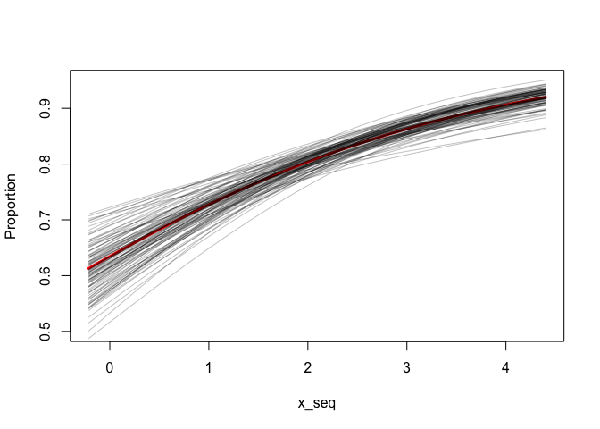

<!-- README.md is generated from README.Rmd. Please edit that file -->
Simulate from beta regressions with Stan or betareg
===================================================

This example shows how to simulate from a beta regression model. First, I do this using the rstanarm package for a fully Bayesian model. Second, I do this with a maximum likelihood model fit with the betareg package by modifying the function `arm::sim()`.

Packages
========

Beta regression was just added into rstanarm, so you will need to install the package from GitHub. This will require a [C++ compiler](https://support.rstudio.com/hc/en-us/articles/200486498-Package-Development-Prerequisites). Sometime in the near future I imagine you'll just be able to install the version from CRAN.

``` r
# install.packages("devtools")
# run this once to install rstanarm!!
# devtools::install_github("stan-dev/rstanarm", args = "--preclean", build_vignettes = FALSE)

library(rstanarm)
#> Loading required package: Rcpp
#> rstanarm (Version 2.14.1, packaged: )
#> - Do not expect the default priors to remain the same in future rstanarm versions.
#> Thus, R scripts should specify priors explicitly, even if they are just the defaults.
#> - For execution on a local, multicore CPU with excess RAM we recommend calling
#> options(mc.cores = parallel::detectCores())
options(mc.cores = parallel::detectCores())
library(betareg)
```

Simulate data
=============

First simulate some data to fit our models to. This is modified from the help file for `rstanarm::stan_betareg`.

``` r
set.seed(1)
N <- 150
x <- rnorm(N, 2, 1)
mu <- binomial(link = "logit")$linkinv(0.8 + 0.3*x)
phi <- exp(1.5)
y <- rbeta(N, mu * phi, (1 - mu) * phi)
hist(y, col = "dark grey", border = FALSE, xlim = c(0,1))
```



``` r
fake_dat <- data.frame(y, x)
```

Stan
====

Now we can fit the model with `rstanarm::stan_betareg`:

``` r
fit <- stan_betareg(y ~ x, data = fake_dat, link = "logit")
print(fit)
#> stan_betareg(formula = y ~ x, data = fake_dat, link = "logit")
#> 
#> Estimates:
#>             Median MAD_SD
#> (Intercept) 0.6    0.2   
#> x           0.4    0.1   
#> (phi)       4.3    0.5   
#> 
#> Sample avg. posterior predictive 
#> distribution of y (X = xbar):
#>          Median MAD_SD
#> mean_PPD 0.8    0.0
fit$stanfit
#> Inference for Stan model: continuous.
#> 4 chains, each with iter=2000; warmup=1000; thin=1; 
#> post-warmup draws per chain=1000, total post-warmup draws=4000.
#> 
#>                 mean se_mean   sd  2.5%    25%    50%    75%  97.5% n_eff
#> (Intercept)     0.55    0.00 0.19  0.18   0.43   0.56   0.68   0.93  3188
#> x               0.43    0.00 0.09  0.26   0.37   0.43   0.49   0.60  2948
#> (phi)           4.29    0.01 0.48  3.40   3.96   4.27   4.59   5.29  2594
#> mean_PPD        0.80    0.00 0.02  0.76   0.78   0.80   0.81   0.83  3134
#> log-posterior 101.04    0.03 1.21 97.84 100.46 101.36 101.93 102.41  1806
#>               Rhat
#> (Intercept)      1
#> x                1
#> (phi)            1
#> mean_PPD         1
#> log-posterior    1
#> 
#> Samples were drawn using NUTS(diag_e) at Mon Jan  9 17:45:33 2017.
#> For each parameter, n_eff is a crude measure of effective sample size,
#> and Rhat is the potential scale reduction factor on split chains (at 
#> convergence, Rhat=1).

plot(fit)
```



``` r
# pp_check(fit)
# prior_summary(fit)
```

We can simulate new observations for a given set of predictor values. This includes both uncertainty in the mean and the beta observation distribution. Below, I picked 2 arbitrary values for `x` to simulate with.

``` r
newdata <- data.frame(x = 3)
p <- posterior_predict(fit, draws = 200, newdata = newdata)
hist(p)
```



``` r

newdata <- data.frame(x = -0.5)
p <- posterior_predict(fit, draws = 200, newdata = newdata)
hist(p)
```



We can also take draws from the posteriors:

``` r
intercept <- as.matrix(fit)[,"(Intercept)"]
beta_x <- as.matrix(fit)[,"x"]

x_seq <- seq(min(x), max(x), length.out = 100)
plot(x_seq, plogis(coef(fit)[[1]] + coef(fit)[[2]] * x_seq), type = "l",
  ylim = c(0.5, 0.95), col = "red", lwd = 3, ylab = "Proportion")
for (i in seq_len(100)) {
  lines(x_seq, plogis(intercept[i] + beta_x[i] * x_seq), col = "#00000040")
}
```



betareg
=======

Now let's do something similar with the betareg package.

First I extracted the function `arm::sim()` from <https://github.com/cran/arm/blob/master/R/sim.R>

Then I modified it as needed to match the output from the betareg package:

``` r
sim_betareg <- function(object, n.sims = 100) {
  object.class <- class(object)[[1]]
  summ <- summary (object, correlation=TRUE, dispersion = object$dispersion)
  coef <- summ$coefficients$mean[,1:2,drop=FALSE]
  dimnames(coef)[[2]] <- c("coef.est","coef.sd")
  beta.hat <- coef[,1,drop=FALSE]
  sd.beta <- coef[,2,drop=FALSE]
  k <- length(object$coefficients$mean)
  corr.beta <- cov2cor(vcov(object))[1:k, 1:k]
  V.beta <- corr.beta * array(sd.beta,c(k,k)) * t(array(sd.beta,c(k,k)))
  beta <- array (NA, c(n.sims,k))
  dimnames(beta) <- list (NULL, dimnames(beta.hat)[[1]])
  for (s in 1:n.sims){
    beta[s,] <- MASS::mvrnorm (1, beta.hat, V.beta)
  }
  beta2 <- array (0, c(n.sims,length(coefficients(object))))
  dimnames(beta2) <- list (NULL, names(coefficients(object)))
  beta2[,dimnames(beta2)[[2]]%in%dimnames(beta)[[2]]] <- beta
  beta2 <- beta2[, 1:k]
  beta2
}
```

Now we can fit the model and take draws from the coefficients.

``` r
fit2 <- betareg(y ~ x, data = fake_dat, link = "logit")
summary(fit2)
#> 
#> Call:
#> betareg(formula = y ~ x, data = fake_dat, link = "logit")
#> 
#> Standardized weighted residuals 2:
#>     Min      1Q  Median      3Q     Max 
#> -2.1103 -0.7360 -0.0685  0.5154  3.5817 
#> 
#> Coefficients (mean model with logit link):
#>             Estimate Std. Error z value Pr(>|z|)    
#> (Intercept)   0.5518     0.1842   2.996  0.00274 ** 
#> x             0.4297     0.0864   4.973 6.58e-07 ***
#> 
#> Phi coefficients (precision model with identity link):
#>       Estimate Std. Error z value Pr(>|z|)    
#> (phi)   4.3140     0.4965    8.69   <2e-16 ***
#> ---
#> Signif. codes:  0 '***' 0.001 '**' 0.01 '*' 0.05 '.' 0.1 ' ' 1 
#> 
#> Type of estimator: ML (maximum likelihood)
#> Log-likelihood: 108.2 on 3 Df
#> Pseudo R-squared: 0.1404
#> Number of iterations: 12 (BFGS) + 1 (Fisher scoring)

s <- sim_betareg(fit2, n.sims = 100)

x_seq <- seq(min(x), max(x), length.out = 100)
plot(x_seq, plogis(coef(fit2)[[1]] + coef(fit2)[[2]] * x_seq), type = "l",
  ylim = c(0.5, 0.95), col = "red", lwd = 3, ylab = "Proportion")
for (i in seq_len(nrow(s))) {
  lines(x_seq, plogis(s[i, 1] + s[i, 2] * x_seq), col = "#00000040")
}
```



I think it's a little bit trickier if we also want to simulate new observations with the beta distribution because there is some correlation between the mean and the dispersion parameter.
